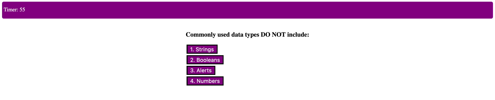

# 4-Code-Quiz
NU BC HW 4: Code Quiz

Live Link: https://mattreisdorf.github.io/4-Code-Quiz/

Reworked this assignment, fixed pretty much everything.

Simple 5 Question Quiz:
    -60 second timer
    -Removes 10 seconds from timer on incorrect answer
    -Quiz fails if time runs out
    -Lets user save last score to local storage

Worked on with Jeremy Joanet and Zach Duty